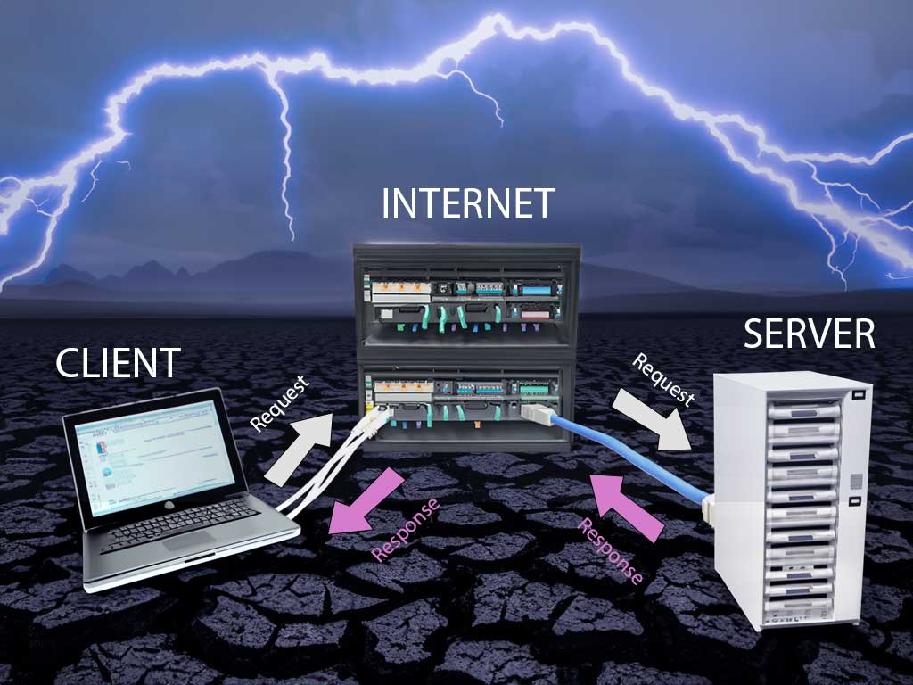
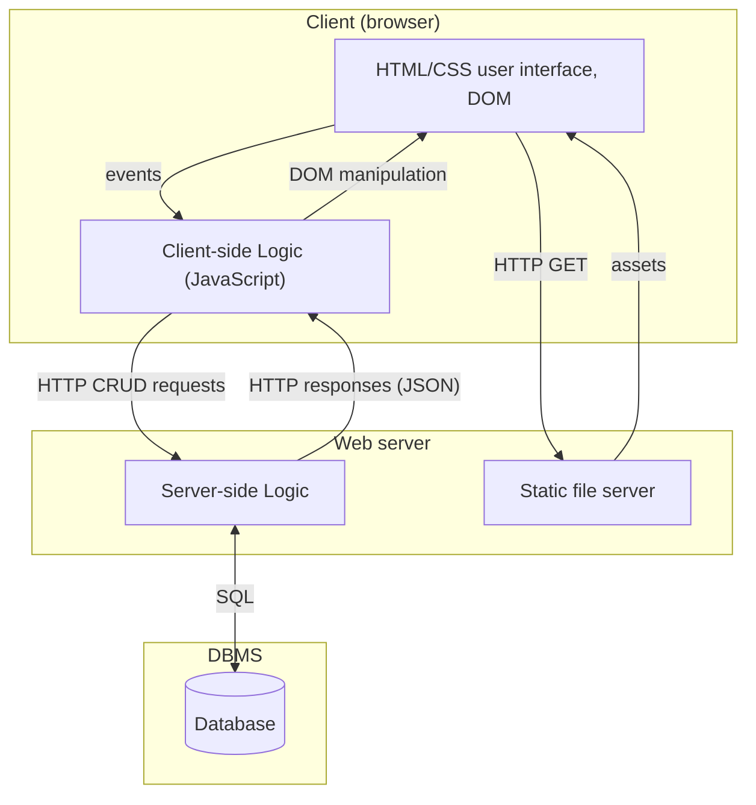
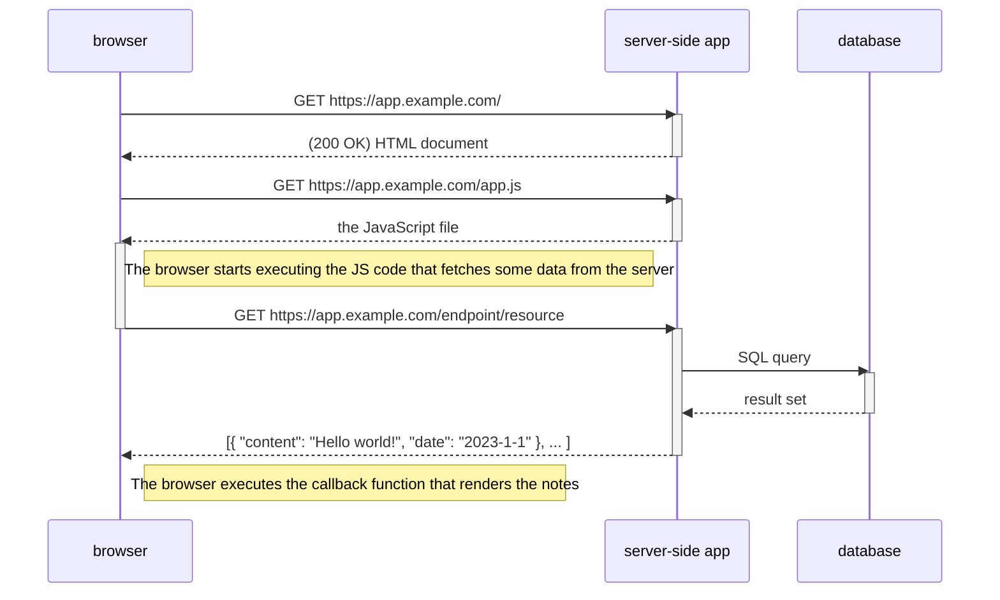
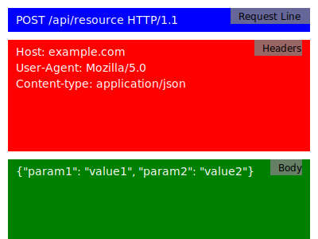
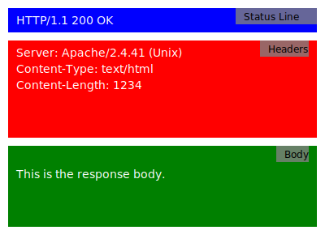

# How web application works



---

## Client-Server Architecture

Typical client-server architecture in web applications



1. The client, which can be a user's device (e.g., computer or smartphone) with a web browser, connects to the server over the internet.
   - The _Hypertext Transfer Protocol (HTTP)_ is commonly used for communication between the client and server.
1. Web browser (the Client) loads HTML, CSS, JavaScript, images and other static UI files from the server using HTTP **GET** requests.
1. The user interacts with the user interface on the client side.
1. Based on the interaction, the Client-side Logic prepares a request to send to the server.
1. The _request_ for a _resource_ is sent to the Server.
   - Requests can be of various types, such as **GET**, **POST**, **PUT**, **DELETE**, etc., depending on the action being performed.
   - Resources are identified using **URLs** (Uniform Resource Locators).
1. On the server side, the server-side logic processes the request. This may involve querying a database or performing other operations.
   - Web applications store and retrieve data using databases like MySQL, PostgreSQL, or MongoDB.
   - Back-end code interacts with the database to perform operations like storing, updating, and retrieving information.
1. The server generates a response and sends it back to the client. The response can be in the form of HTML, CSS, JavaScript, or data in other formats like **JSON** or XML.
1. The client (JavaScript code run by the browser) processes the response, updating the User Interface or performing other actions as necessary. This mechanism is often referred to as "Client-Side Rendering".
1. Users continue to interact with the web application and trigger new HTTP requests, which the server processes to provide the desired data.
   - Users interact with the web application by performing actions like clicking buttons or submitting forms.
   - These interactions trigger new requests from the client to the server, creating a continuous cycle of interaction.



## HTTP request



```http
POST /index.html HTTP/1.1
Host: example.com
User-Agent: Mozilla/5.0 (Windows NT 10.0; Win64; x64) AppleWebKit/537.36 (KHTML, like Gecko) Chrome/91.0.4472.124 Safari/537.36
Accept: text/html,application/xhtml+xml
Accept-Language: en-US,en;q=0.9
Content-Type: application/json

{"username": "frank", "password": "12345"}
```

- **POST**: The HTTP method used to retrieve a resource.
- **/index.html**: The path of the resource we want to retrieve.
- **HTTP/1.1**: The version of the HTTP protocol being used.
- **Host: example.com**: The hostname of the server where the resource is located.
- **User-Agent**: The user agent string identifying the client.
- **Accept**: The types of content the client can understand.
- **Accept-Language**: The preferred languages for the response.
- **Content-Type**: Tell what kind of data is in the body.
- **Body**: for sending data with POST and PUT methods

### HTTP methods

Common HTTP request methods include:

- **GET**: Retrieve data from the server (e.g., a web page or API endpoint).
- **POST**: Send data to the server to create a new resource (e.g., submitting a form).
- **PUT**: Update an existing resource on the server.
- **DELETE**: Remove a resource from the server.

---

## HTTP response



```response
HTTP/1.1 200 OK
Server: Apache/2.4.41 (Unix)
Content-Type: text/html
Content-Length: 1234
Date: Sat, 10 Jun 2023 15:30:00 GMT

<!DOCTYPE html>
<html>
<head>
  <title>Example Website</title>
</head>
<body>
  <h1>Welcome to the Example Website!</h1>
  <p>This is the content of the index.html file.</p>
</body>
</html>
```

- **HTTP/1.1 200 OK**: Successful response with status code 200 and message OK.
- **Server: Apache/2.4.41 (Unix)**: Server software and version.
- **Content-Type: text/html**: Content type of the response is HTML.
- **Content-Length: 1234**: Length of the response content in bytes.
- **Date: Sat, 10 Jun 2023 15:30:00 GMT**: Date and time of response generation.
- **Response Body**: The body of the HTTP response comes after two line brakes and contains the actual content being sent back to the client.

---

### HTTP response with an image (or any binary file)

```http request
HTTP/1.1 200 OK
Server: Apache/2.4.41 (Unix)
Content-Type: image/jpeg
Content-Length: 12345
Date: Sat, 10 Jun 2023 15:30:00 GMT

[Binary data representing the JPG image]
```

### Status codes

HTTP status codes are issued by a server in response to a client's request made to the server. They help the client understand the result of their request. Status codes are grouped into five classes:

- **1xx (Informational)**: The request was received, and the process is continuing.
- **2xx (Successful)**: The request was successfully received, understood, and accepted.
  - **200 OK**: The request has succeeded. The meaning of the success depends on the HTTP method used.
  - **201 Created**: The request has been fulfilled and has resulted in the creation of a new resource.
- **3xx (Redirection)**: Further action needs to be taken by the user agent to fulfill the request.
  - **301 Moved Permanently**: The requested resource has been assigned a new permanent URI.
  - **302 Found**: The requested resource resides temporarily under a different URI.
- **4xx (Client Error)**: The request contains bad syntax or cannot be fulfilled.
  - **400 Bad Request**: The server could not understand the request due to invalid syntax.
  - **401 Unauthorized**: The client must authenticate itself to get the requested response.
  - **403 Forbidden**: The client does not have access rights to the content.
  - **404 Not Found**: The server can not find the requested resource.
- **5xx (Server Error)**: The server failed to fulfill an apparently valid request.
  - **500 Internal Server Error**: The server has encountered a situation it doesn't know how to handle.
  - **502 Bad Gateway**: The server, while acting as a gateway or proxy, received an invalid response from the upstream server.
  - **503 Service Unavailable**: The server is not ready to handle the request, often due to maintenance or overload.

More information on [HTTP status code](https://developer.mozilla.org/en-US/docs/Web/HTTP/Status) in the Mozilla Developer Network documentation.

## REST

**Re**presentational **S**tate **T**ransfer, is an architectural style for designing distributed systems. REST is often used in the context of web services, especially when building APIs. RESTful architecture is based on HTTP protocol. In this course we build a REST interface for client-server communication.

Common principles of RESTful architecture:

- **Stateless Communication**: Each request from a client to a server must contain all the information needed to understand and process the request. The server should not retain any client state between requests. This makes it easier to scale, as there's no session information to manage between requests.
- **Client-Server**: The client and server are separate entities that communicate over a network. The client is responsible for the user interface and user experience, while the server is responsible for processing requests, managing data, and executing most of the business logic.
- **Cacheability**: Responses from the server can be labeled as cacheable or non-cacheable. When a response is cacheable, clients can reuse it for equivalent requests in the future, leading to better performance and reduced server load. Responses from the server should clearly indicate their cacheability to help clients understand when a resource's representation is fresh and when it needs to be re-requested.
- **Uniform Interface** simplifies and decouples the architecture, allowing each part to evolve independently. Constraints that define this uniform interface include:
  - **Resource Identification**: Each resource (like a user, product, etc.) is identified by a unique URI (Uniform Resource Identifier). e.g. `https://example.com/resource/id`
  - **Resource Manipulation through Representations**: Clients interact with resources by getting and modifying their representations (usually in formats like **JSON** or XML).
  - **Self-descriptive Messages**: Each message contains enough information about how to process the message (e.g., using HTTP methods and status codes).
- **HTTP Methods**: In the context of web services and APIs, REST usually relies on [standard HTTP methods](#http-methods).
- **HTTP Status Codes:** Each response is served with an appropriate [HTTP status code](#status-codes).

REST APIs are popular due to their simplicity, scalability, and performance. When an API adheres to these principles, it's often referred to as a "RESTful" API.

---


## Front-End Development

Front-end development involves creating the user interface for the client like a web browser.Front-end developers implement the design and interactivity of the web application.

### Client-side technologies

#### HTML

- HTML (HyperText Markup Language) is the standard markup language for creating web pages.
- It provides the structure and content of a webpage, using elements like headings, paragraphs, links, images, and more.

#### CSS

- CSS (Cascading Style Sheets) is used for styling and layout of web pages.
- It allows developers to apply styles to HTML elements, including colors, fonts, spacing, and positioning.

#### JavaScript / TypeScript

- JavaScript is a programming language that enables interactivity and dynamic content on web pages.
- It allows developers to create responsive user interfaces, handle events, and manipulate the DOM (Document Object Model).
- TypeScript is a superset of JavaScript that adds static typing, making it easier to catch errors during development and improve code quality.

#### Front-end frameworks and libraries

- Front-end frameworks and libraries provide pre-built components and tools to streamline the development process.
- Popular front-end frameworks include React, Angular, and Vue.js.
- These frameworks help developers build complex user interfaces more efficiently by providing reusable components and a structured approach to application development.

## Back-End Development

Back-end development handles server-side logic and data processing. Programming language + application framework + database + runtime environment (server) = server-side (back-end) application:

- Programming language is a tool for writing code, specifying algorithms, and instructing a computer.
- Framework is a higher-level structural foundation that provides guidelines, pre-written code, and tools for building applications in a specific domain. Developers often use programming languages within the context of a framework to streamline the development process and adhere to best practices for a particular type of application, such as web development or mobile app development.
- Running environment, often referred to as the "runtime environment" or simply the "runtime," is the software and hardware infrastructure where the server-side code of an application executes. This environment provides the necessary resources and services for the server-side code to run, handle requests, process data, and generate responses.
- All permanent data used by the application itself or saved by the users of the application is stored in the database.
  - Relational databases like MySQL, MariaDB, PostgreSQL, and/or NoSQL databases like MongoDB, Cassandra, and Redis are commonly used for storing and retrieving persistent data in web applications.

### Server-side technologies

#### Python

- Python is a high-level, interpreted, and versatile programming language known for its simplicity, readability, and extensive standard library.
- Flask is a lightweight web framework for Python. It is designed to be simple and easy to use, making it an excellent choice for building web applications, particularly when you want to get a project up and running quickly. Flask provides the basic tools and libraries needed for web development without imposing too much structure or unnecessary complexity.
- Django is a high-level web framework built on Python. Django follows the MVC architectural pattern and provides a wide range of built-in features for rapid web application development.

#### PHP

- PHP is a server-side scripting language designed specifically for web development. It powers a significant portion of the web.
- Frameworks like Laravel and Symfony provide modern tools and patterns for PHP web application development.
- Most web hotels and e.g. <users.metropolia.fi> home page server support PHP runtime by default.
- For example popular blog/website application Wordpress is written in PHP

#### Java

- Java is a widely used programming language for building robust and scalable web applications.
- For example Spring Boot is a framework that simplifies Java web development by providing a set of conventions and tools for creating production-ready applications.

#### ASP.NET

- ASP.NET is an open-source, server-side web-application framework developed by Microsoft.
- Supports .NET languages like C#.

#### Ruby on Rails

Ruby on Rails, often referred to as Rails, is a web application framework written in Ruby. It emphasizes convention over configuration and follows the Model-View-Controller (MVC) architectural pattern, making it a productive choice for building web applications.

#### JavaScript and Node.js

- JavaScript is a high-level, often just-in-time compiled language that follows the [ECMAScript standard](https://www.ecma-international.org/publications-and-standards/standards/ecma-262/).
- The ECMAScript standard does not include any input/output (I/O), such as networking, storage, text, or graphics. In practice, the web browser or other runtime system provides APIs for I/O (on the client-side).
- Node.js is a popular runtime environment that allows developers to write server-side code in JavaScript. It is known for its non-blocking, event-driven architecture, making it well-suited for building scalable and high-performance web applications.
- Express.js is a minimal and flexible Node.js web application framework that provides a robust set of features for building web and mobile applications. It is often used for creating RESTful APIs.

---

## Overall

- Web applications combine front-end and back-end technologies to deliver a user-friendly interface.
- They process user input, enabling interaction with the application's functionalities.
- Web applications retrieve and store data, facilitating efficient information management.
- They provide dynamic functionality, offering real-time updates and personalized experiences.
- Users access web applications through their web browsers, making them easily accessible.
- Web applications offer a wide range of services and features tailored to specific needs.
- They provide online access to various resources, such as educational materials, tools, and services.
- Web applications facilitate collaboration and communication among users.
- They may include features like discussion boards, messaging systems, and shared document repositories.
- Web applications enhance convenience by enabling access from anywhere with an internet connection.

---

<!-- add mermaid support for gh pages -->
<script type="module">
    Array.from(document.getElementsByClassName("language-mermaid")).forEach(element => {
      element.classList.add("mermaid");
    });
    import mermaid from 'https://cdn.jsdelivr.net/npm/mermaid@11/dist/mermaid.esm.min.mjs';
    mermaid.initialize({ startOnLoad: true });
</script>
