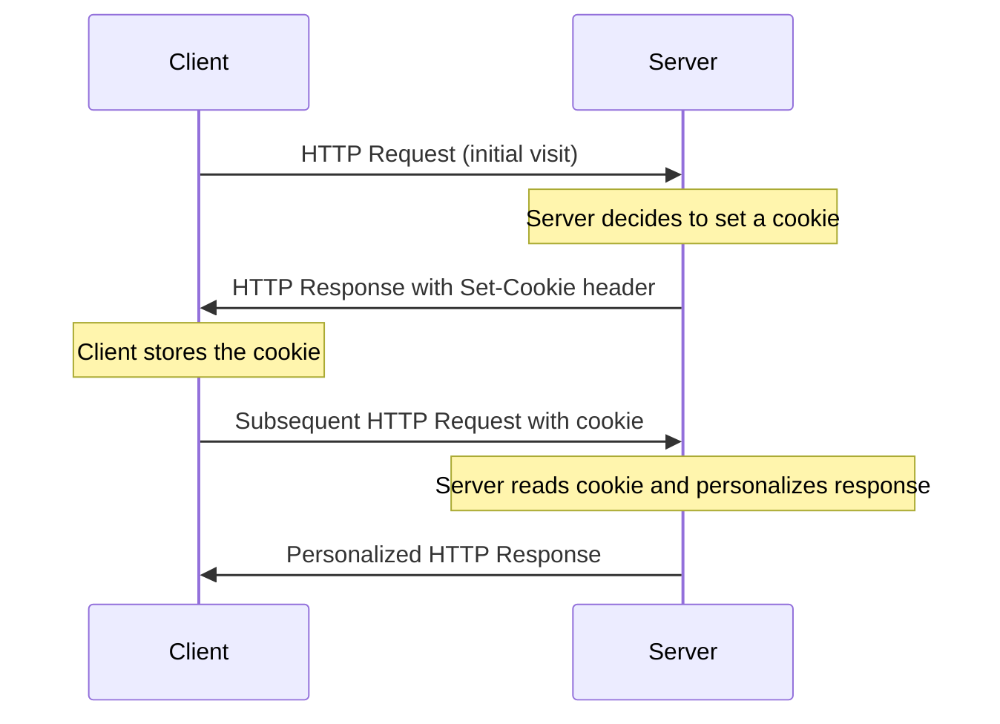
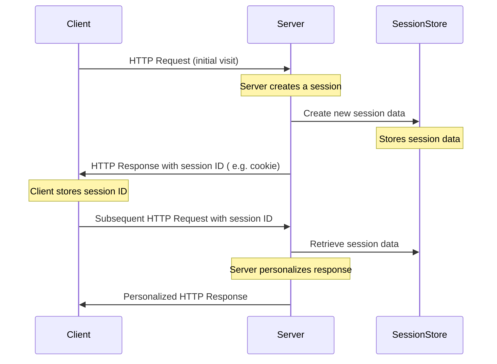
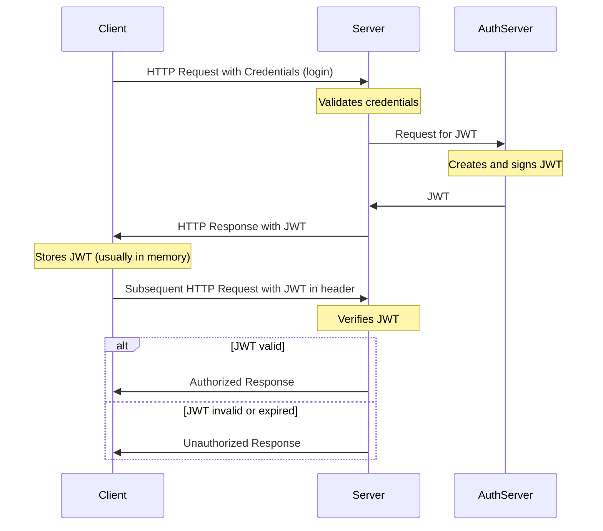

# Application State and User Authentication

---

### Authentication

Authentication is the process of verifying the identity of a user. It is the process of determining whether someone or something is, in fact, who or what it is declared to be.

### Authorization

Authorization is the process of determining whether a user has permission to perform a specific action. It is the process of granting or denying access to a network resource.

---

## Maintaining State in Web Applications

In any realistic interactive Web application you will come across the need of retaining information between individual pages. This is referred to as "maintaining state" or as the "persistence of data". HTTP protocol does not support this, it is a _stateless_ protocol - every page request starts in a blank state with no knowledge of data that was available on the previous page. Since HTTP is stateless by nature, web applications need to implement their own methods for maintaining state. There is several common strategies to implement this on the server-side.

Choosing the right method for maintaining state depends on the specific requirements of your application, such as the type of data being stored, security considerations, scalability, and whether the state is user-specific or shared across users. It's common to use a combination of these methods to address different aspects of application state.

### Cookies

- Small pieces of data stored on the client's browser. Cookies are sent back to the server with every HTTP request.
- Cookies store variables as name and value pairs, plus additional information such as expiration time and the name of website where the cookie came form.
- By default, website can modify only its own cookies
  Use Cases: Remembering user preferences, authentication tokens, tracking sessions.
  Limitations: Size is limited (typically 4KB), and they can pose security and privacy concerns if not handled correctly.



### Server-Side Sessions

- Server stores session data, and a session identifier is typically sent to the client (often in a cookie or in HTTP headers/URL query params).
- Can be used for user authentication and storing for user-specific data while the user navigates the application.
- Requires server resources and proper management to ensure scalability and security.



### URL Parameters and Query Strings

- Passing state information in URLs as query strings. For example: `https://example.com/app?user=johndoe&theme=dark`.
- Maintaining state across different pages without needing server or client-side storage, such as filtering or search parameters.
- Visible to users, can be modified, and have length limitations.

### Hidden Form Fields

- Storing state information in hidden fields within HTML forms. For example:

  ```html
  <form action="https://example.com/app">
    <input type="hidden" name="user" value="johndoe">
    <input type="hidden" name="theme" value="dark">
    <input type="submit" value="Submit">
  </form>
  ```

- Maintaining state across form submissions.
- Only applicable for state that needs to persist across form submissions.

### Token-Based Authentication

- Tokens (e.g. [JSON Web Tokens (JWT)](https://jwt.io/)) are used to maintain user state and authentication information.
    - usually used for authentication and authorization purposes, especially in Single Page Applications (SPAs) and API services.
- Consider security in storing and transporting tokens, typically requires HTTPS.

The process of authentication using JWT and subsequent requests with the token in typical client-server interaction:


--- 

## Bcrypt

- Bcrypt is a password-hashing function designed to be slow and computationally intensive to protect against brute-force attacks.
- Bcrypt is a one-way hash function, meaning that it is not possible to reverse the hash to obtain the original password.
- Bcrypt is commonly used for securely storing passwords in databases.
- Usage in Node.js: [bcrypt](https://www.npmjs.com/package/bcrypt)

---

### Client-Side State Management

- Web Storage API
    - Local Storage: Stores data with no expiration date, and it's accessible across browser sessions.
    - Session Storage: Similar to Local Storage but limited to a single session. The data is cleared when the page session ends.
    - Storing user data like settings, application state, and other temporary data that doesn’t need to persist long-term.
    - Data is only accessible on the client side and limited to about 5 MB.
- Client-Side Frameworks and Libraries like React (with Context API or Redux), Angular (with services), Vue.js (with Vuex) provide their own mechanisms for maintaining state on the client side.

### State in Express

Express is a minimalistic framework that does not provide any built-in mechanisms for maintaining state. However, it is easy to implement your own state management using cookies, sessions, or other methods.

- **Cookies:** you can use the [cookie-parser](https://expressjs.com/en/resources/middleware/cookie-parser.html) middleware to parse cookies from the request headers, and then use the [`res.cookie`](https://expressjs.com/en/api.html#res.cookie) to set cookies in the response headers. ([Tutorialspoint cookie example](https://www.tutorialspoint.com/expressjs/expressjs_cookies.htm)).
- **Sessions:** you can use the [express-session](https://expressjs.com/en/resources/middleware/session.html) middleware to manage sessions. ([Tutorialspoint session example](https://www.tutorialspoint.com/expressjs/expressjs_sessions.htm)).
- **Token-Based Authentication:** you can use the [jsonwebtoken](https://www.npmjs.com/package/jsonwebtoken) package to generate and verify JWT tokens. Or the ready-made [express-jwt](https://www.npmjs.com/package/express-jwt) middleware.

## User Authentication and Authorization with JWT in Express

- **Authentication** is the process of verifying the identity of a user.
- **Authorization** is the process of verifying that the user has access to the requested resource.

In web applications, authentication is typically done by verifying a username and password combination. Authorization is typically done by checking the user's role or permissions.

### Assignment

1. Create new branch `assignment6` based on `main`
2. Install [jsonwebtoken](https://www.npmjs.com/package/jsonwebtoken)
3. Install [bcrypt](https://www.npmjs.com/package/bcrypt)
4. Generate a secret key for signing the tokens and store it in the `.env` file: `JWT_SECRET=...`
    - use a long random string, e.g. from [random.org](https://www.random.org/strings/)
    - or use the `crypto` module to generate a random string
5. Modify `postUser()` in `user-controller.js` to hash the password before saving it to the database:
    
    ```js
    import bcrypt from 'bcrypt';
    ...
   const postUser = async (req, res) => {
      // modify req.body.password:
      req.body.password = bcrypt.hashSync(req.body.password, 10);
    ...
    ```

6. Create a new user and check that the password is hashed in the database.
7. Create a route `POST /api/v1auth/login` that accepts a username and password in the request body.
    - add a new route handler to `routes/auth-router.js`, controller method to `controllers/auth-controller.js`, and use the user model to query the database or create a new model for authentication.
8. In the user model implement a method for fetching user by username and returning the user object if found:

   ```js
   ...
   const findUserByUsername = async (user) => {
       const sql = `SELECT *
                 FROM wsk_users 
                 WHERE username = ?`;
   ...
   ...
   ```

9. In the `auth-controller.js` implement token generation for the logged-in user, something like this:

    ```js
    import jwt from 'jsonwebtoken';
    import bcrypt from 'bcrypt';
    import {findUserByUsername} from '../models/user-model.js';
    import 'dotenv/config';
    
    const postLogin = async (req, res) => {
      console.log('postLogin', req.body);
      const user = await findUserByUsername(req.body.username);
      if (!user) {
        res.sendStatus(401);
        return;
      }
    
      const passwordMatch = await bcrypt.compare(req.body.password, user.password);
      if (!passwordMatch) {
        res.sendStatus(401);
        return;
      }
      
      const userWithNoPassword = {
        user_id: user.user_id,
        name: user.name,
        username: user.username,
        email: user.email,
        role: user.role,
      };

      const token = jwt.sign(userWithNoPassword, process.env.JWT_SECRET, {
        expiresIn: '24h', // token expiration time, e.g. 24 hours, can be configured in .env too
      });
      res.json({user: userWithNoPassword, token});
    };
    
    export {postLogin};
    ```

    - If the user is found, `jsonwebtoken` is used to generate a JWT token and then token is sent back to the client along with the user object.
    - Do not send the password (even hashed) back to the client.

10. Create a middleware for handling requests to endpoints where authentication is needed `src/middlewares/authentication.js`

     ```js
     import jwt from 'jsonwebtoken';
     import 'dotenv/config';
    
     ...
    
     const authenticateToken = (req, res, next) => {
       console.log('authenticateToken', req.headers);
       const authHeader = req.headers['authorization'];
       const token = authHeader && authHeader.split(' ')[1];
       console.log('token', token);
       if (token == null) {
         return res.sendStatus(401);
       }
       try {
         res.locals.user = jwt.verify(token, process.env.JWT_SECRET);
         next();
       } catch (err) {
         res.status(403).send({message: 'invalid token'});
       }
     };

     export {authenticateToken};
     ```

11. Add a new route handler for `GET /api/v1/auth/me` that returns the user object based on the token in the request header:

     ```js
     // controller:
     const getMe = async (req, res) => {
       console.log('getMe', res.locals.user);
       if ( res.locals.user) {
         res.json({message: 'token ok', user:  res.locals.user});
       } else {
         res.sendStatus(401);
       }
     };
    
     // router:
     ...
     import {getMe, postLogin} from '../controllers/auth-controller.js';
     import {authenticateToken} from '../middlewares/authentication.js';
     ...
     authRouter.route('/me').get(authenticateToken, getMe);
     ...
     ```

12. Test login and the protected route with Postman or VS Code REST Client:

     ```http
     ### Post login
     POST http://localhost:3000/api/v1/auth/login
     content-type: application/json

     {
       "username": "JohnDoe",
       "password": "to-be-hashed-pw1"
     }
     ```

     - Check the response and copy the token from the response body
     - When using VS Code REST client you can store the token to variable

     ```http
     @token = <put-your-token-from-login-response-here>

     ### Get my user info
     GET http://localhost:3000/api/v1/auth/me
     Authorization: Bearer {{token}}
     ```
     
     - Use the `Authorization` header with `Bearer <token>` for all routes that need authentication
     - or test with Postman (just set 'Bearer token' on 'Authorization' tab after succesful login POST).

13. Now you can use the authentication middleware with any route where needed.
     - Information about the authenticated user is passed to the controller in `res.locals.user` object.
14. Implement authorization for protected routes, e.g.:
     - `PUT /api/v1/cats/:id` - only file owner can update cats
     - `DELETE /api/v1/cats/:id` - only file owner can delete cat
     - `PUT /api/v1/users/` - users can update only their own user info
     - and so on...
     - describe your rules in report/readme/docs
15. Implement user roles (e.g. admin, user) with different permissions (role based resource authorization)
     - Regular users can only delete and edit their own userdata and cats.
         - Modify the `DELETE` and `UPDATE` SQL queries in models so that queries will also check that the owner of the item (user_id) matches the `owner` property in the `req.locals.user` object. `req.locals.user` is decoded from the token and needs to be passed as a parameter from controller to corresponding model method.
     - Admin level users can update or delete any cat, user info, etc.
         - Add second `DELETE` and `UPDATE` SQL queries into model functions that do not check the `user_id` property when role is admin.
         - Use e.g. conditional statements in the models to decide which SQL query to use based on the user level.
         - With users, it is easier to block unauthorized access in the controller. If `res.locals.user.user_id` is the same as `req.params.id`  or if `res.locals.user.role` is 'admin' then continue, else return 403. Note that `res.locals.user` is number and `req.params.id` is string
16. Test the authorization rules with Postman or VS Code REST Client.
17. You can test the app also with the front end from [this ZIP](../zip/cat-ui.zip).
   - Unzip and use VSCode Live Server to open the `index.html` folder.
   - You'll notice that nothing works. Look at the console and network tabs in the browser developer tools to see what's going on. You'll see some CORS errors (scroll down this page for more info on CORS).
   - Fix the CORS errors by adding `cors` middleware to your Express app: `npm i cors`. Then add `app.use(cors())` to your `app.js` file.
   - You can prevent CORS issues by serving the front-end application from the same origin as the back-end, e.g. using Express static middleware (see `public` folder in our example).
18. Commit your changes to version control.
19. Merge the `assignment6` branch to the `main` branch and push the changes to the remote repository.

---

## Web Application Security 

### Data Security

Data security refers to the protective measures and techniques used to safeguard data from unauthorized access, alteration, or destruction. Its main goal is to ensure data integrity, availability, and confidentiality. Techniques for ensuring data security include:

- **Access Control**: Ensuring that only authorized individuals can access specific data sets.
- **Encryption**: Transforming data into a secure format that unauthorized users cannot easily interpret.
- **Backups**: Creating copies of data to prevent loss in case of hardware failure, natural disasters, or other disruptions.
- **Network Security**: Protecting data in transit across networks from interception or intrusion.
- **Physical Security**: Safeguarding the physical devices and infrastructure where data is stored.
- **Vulnerability Management**: Regularly updating software and systems to protect against known security vulnerabilities.

Data security techniques are applied across different layers, including the physical hardware, the software, the network, and the users who interact with the data. The user is often the weakest link in the security chain, so it’s important to educate users about security best practices and to implement proper access controls to prevent unauthorized access.

## Data Privacy

Data privacy means proper handling, processing, and storage of personal information, ensuring that it’s used in a fair, legal, and transparent manner. Privacy is more about the rights of individuals regarding their personal data:

- **Consent**: Ensuring that individuals have consented to the collection and use of their personal data.
- **Minimal Collection**: Collecting only the data that is necessary for the defined purpose.
- **Data Anonymization**: Removing or modifying personal information so that individuals cannot be readily identified.
- **Transparency**: Being clear with individuals about how their data is being used.
- **Legal Compliance**: Adhering to data protection laws and regulations, such as GDPR (General Data Protection Regulation) in the European Union

Data privacy is often ensured through policies, legal agreements (like privacy policies), and user controls that allow individuals to understand and manage how their data is used.

While data security and data privacy are distinct, they are deeply interconnected. Effective data privacy cannot exist without robust data security measures, as securing data is fundamental to maintaining its privacy. However, you can have high data security without necessarily ensuring data privacy. For instance, a database might be well-secured against unauthorized access but could still be used in ways that violate privacy if proper data handling policies are not in place.

## Practical Security in REST APIs

1. **[HTTPS](https://en.wikipedia.org/wiki/HTTPS) (SSL/TLS) for Communication**
    - HTTP over [TLS/SSL](https://en.wikipedia.org/wiki/Transport_Layer_Security) (TLS is the new progression of SSL but the _term_ SSL is still generally used)
    - [SSL certificate](https://www.kaspersky.com/resource-center/definitions/what-is-a-ssl-certificate) _authenticates_ a website's identity and enables an encrypted connection
    - Protection of the _privacy_ and _integrity_ of the exchanged data
    - Always use HTTPS to encrypt data in transit and protect against eavesdropping, man-in-the-middle attacks, and data tampering.
    - When using node.js, it is generally better to implement TLS in reverse-proxy such as Apache or Nginx, (just like we did with our [example deployment](08-deployment.md#nodejs-runtime-and-process-management))
    - All unsecure HTTP connections (port 80) should be automatically redirected to HTTPS (port 443) by using [HTTP status codes](https://www.w3.org/Protocols/rfc2616/rfc2616-sec10.html), the 3XX codes are redirect, 301 means Moved Permanently.
    - (Typically, for localhost development environments secure connections are not needed)
1. **Authentication**
    - Implement strong authentication mechanisms to ensure that only authorized users or systems can access the API.
    - Common methods include API keys, OAuth, JWT (JSON Web Tokens), or other token-based systems.
1. **Authorization**
    - Define and enforce proper access controls to restrict users or systems to only the resources they are allowed to access.
    - Implement role-based access control (RBAC) or attribute-based access control (ABAC) as needed. (Models can be combined.)
    - RBAC is a widely used access control model based on predefined roles within an organization. In this model, access permissions are assigned to roles rather than to individual users. When a user is assigned a role, they inherit the permissions associated with that role.
        - For example, a user might be assigned the role of "admin," which comes with permissions to create, read, update, or delete data. Another user might be assigned the role of "guest," which allows them to only read data.
    - ABAC is a more flexible and fine-grained access control model that bases access decisions on attributes. These attributes can be related to the user, the resource being accessed, the action being performed, and the context (like time of day or IP address).
        - For example, a user might be allowed to read data only during business hours or only from a specific IP address.
1. **Token Management**
    - If using tokens (such as JWT), ensure proper token validation, expiration checks, and secure storage.
    - Check that the user stored in the token is still valid and has the required permissions.
        - For example, if a user is deleted from the database, their token should no longer be valid.
    - Implement token revocation mechanisms in case of compromised tokens.
        - In practice, this means that the server should keep track of issued tokens and their validity. If a token is compromised, it can be added to a blacklist and rejected by the server.
1. **Secure Data Transmission**
    - Avoid exposing sensitive information in the URL; use request headers or the request body for transmitting sensitive data.
    - Be cautious with query parameters and ensure they do not expose sensitive information.
1. **Data Protection**
    - Protect persistent data
    - Implement strict access control. This includes defining database users and privileges ensuring that users/applications have access only to the data necessary for their role.
    - Encrypt sensitive data (like passwords) in the database and ensure that only authorized individuals can access it.
1. **Input Validation**
    - Validate and sanitize all incoming data to prevent injection attacks, such as SQL injection, NoSQL injection, or script injection.
    - Enforce strong validation for data types, lengths, and formats.
1. **Output Encoding**
    - Encode output data to protect against Cross-Site Scripting (XSS) attacks. HTML, XML, or JSON encoding should be applied depending on the output format.
1. **Error Handling**
    - Provide meaningful error messages to clients without revealing sensitive information.
    - Log errors securely on the server side for monitoring and debugging.
1. **[Same-origin policy (SOP)](https://developer.mozilla.org/en-US/docs/Web/Security/Same-origin_policy) and [Cross-Origin Resource Sharing (CORS)](https://developer.mozilla.org/en-US/docs/Web/HTTP/CORS)**
    - SOP is a security mechanism that restricts how a document or script loaded by one [origin](https://developer.mozilla.org/en-US/docs/Web/Security/Same-origin_policy#definition_of_an_origin) can interact with a resource from another origin.
    - CORS is an HTTP-header based mechanism that allows a server to indicate any origins other than its own from which a browser should permit loading resources.
    - Implement proper CORS headers to control which domains are allowed to access the API if needed.
    - Be restrictive with CORS configurations to prevent unauthorized cross-origin requests.
1. **Rate Limiting**
    - Implement rate limiting to prevent abuse, brute-force attacks, or denial-of-service attacks.
    - Configure sensible rate limits based on the nature of the API.
    - Can be implemented in the API itself or in a reverse proxy.
1. **Logging and Monitoring**
    - Log security-relevant events and regularly monitor logs for suspicious activity.
    - Set up alerts for unusual patterns or potential security incidents.
1. **API Versioning**
    - Consider versioning your API to avoid breaking changes and to allow clients to migrate at their own pace.
1. **Security Headers**
    - Utilize security headers, such as [Content Security Policy (CSP)](https://developer.mozilla.org/en-US/docs/Web/HTTP/CSP) and [Strict-Transport-Security (HSTS)](https://developer.mozilla.org/en-US/docs/Glossary/HSTS), to enhance overall security.
1. **Security Reviews and Audits**
    - Regularly conduct security reviews and audits of your API design, code, and infrastructure.
    - Stay informed about security best practices and vulnerabilities relevant to your technology stack.

## OWASP Top 10

>The OWASP® Foundation works to improve the security of software through its community-led open source software projects, hundreds of chapters worldwide, tens of thousands of members, and by hosting local and global conferences.

- [OWASP Top 10](https://owasp.org/www-project-top-ten/) lists the top 10 most critical web application security risks.

## Application Security in Express

Reading:

- [Handling CORS in Express](https://expressjs.com/en/resources/middleware/cors.html)
- [Express Security Best Practices](https://expressjs.com/en/advanced/best-practice-security.html)
- [OWASP REST Security Cheat Sheet](https://cheatsheetseries.owasp.org/cheatsheets/REST_Security_Cheat_Sheet.html)
- [OWASP NodeJS Security Cheat Sheet](https://cheatsheetseries.owasp.org/cheatsheets/Nodejs_Security_Cheat_Sheet.html)

### Password Security

- Read: [Salted Password Hashing - Doing it Right](https://crackstation.net/hashing-security.htm)
- xkcd comic classics: [Password Strength](https://xkcd.com/936/), [Password Reuse](https://xkcd.com/792/)
- [How long it takes to crack a password?](https://www.hivesystems.com/password)

---

---

<!-- add mermaid support for gh pages -->
<script type="module">
    Array.from(document.getElementsByClassName("language-mermaid")).forEach(element => {
      element.classList.add("mermaid");
    });
    import mermaid from 'https://cdn.jsdelivr.net/npm/mermaid@11/dist/mermaid.esm.min.mjs';
    mermaid.initialize({ startOnLoad: true });
</script>
