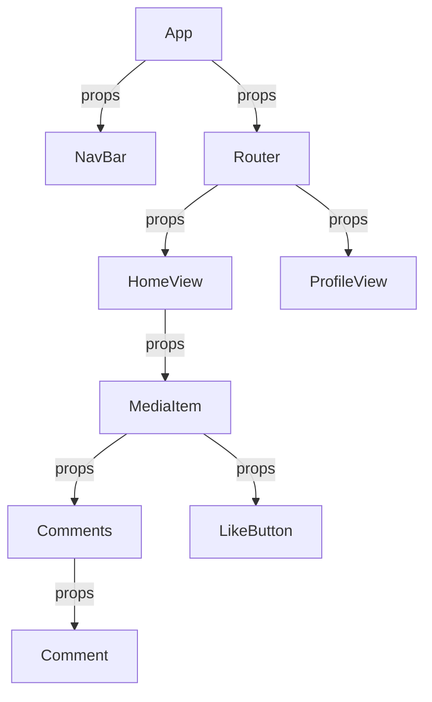
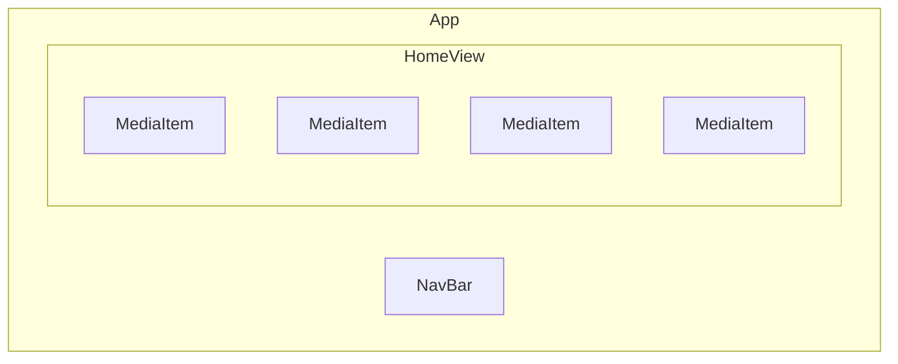

# React

## About React

React is a popular open-source JavaScript library for building user interfaces, particularly for single-page applications. It's maintained by Facebook and a community of individual developers and companies. React was first introduced in 2013 and has since gained widespread adoption due to its flexibility, efficiency, and robust ecosystem.

### Main features

- **Component-Based Architecture:** React is built around the concept of components. A component in React is a piece of the UI. Each component is a JavaScript class or a function that can accept inputs (called "props") and returns a React element (typically via JSX) that describes how a section of the UI should appear.
- **JSX (JavaScript XML):** JSX is a syntax extension for JavaScript that looks similar to HTML. It's used with React to describe the UI's structure. JSX may look like template language, but it comes with the full power of JavaScript.
- **Virtual DOM:** React uses a virtual DOM (Document Object Model), which is a programming concept where a "virtual" representation of the UI is kept in memory and synced with the "real" DOM by a library such as ReactDOM. This process, known as reconciliation, allows React to update the DOM efficiently. This can lead to improved performance and a smoother user experience.
- **Declarative UI:** React allows developers to create UIs declaratively. This means that you tell React what you want the UI to look like, and React takes care of updating the DOM to match that description when the data changes.
- **State and Lifecycle:** React components can have state, an object that determines how that component behaves and renders. React components also have a lifecycle, with methods that get called at different points in a component's life in the browser, allowing for fine-grained control of its behavior.
- **Hooks:** Hooks are functions that let you "hook into" React state and lifecycle features from _function components_. Hooks don't work inside _classes_ — they let you use React without classes.
- **Ecosystem and Community:** React has a vast ecosystem of libraries, tools, and extensions. Libraries like Redux for state management and React Router for navigation enhance React's capabilities. The community support and availability of resources, tutorials, and third-party packages are substantial.

## Learning Material

- [React docs](https://react.dev/)
- [Online book: React.js Training](https://rangle-io.gitbooks.io/react-training/content/)
- [Full stack open](https://fullstackopen.com/)

On Youtube:

- [What is React](https://youtu.be/N3AkSS5hXMA)
- [Learn React in five minutes](https://www.youtube.com/watch?v=MRIMT0xPXFI)
- [If five minutes is not enough](https://youtu.be/w7ejDZ8SWv8)
  - [React Router v6 update to previous video](https://youtu.be/k2Zk5cbiZhg)

## Getting started - Setting up a React project

See [Learn React JS](https://www.youtube.com/watch?v=w7ejDZ8SWv8)

1. Development tools
    - The basic set:
      - Git + GitHub
      - Node.js + npm
      - VS Code + extensions, add 'ES7+ React/Redux/React-Native snippets'
      - Browser + dev tools (+ [React Developer Tools](https://chromewebstore.google.com/detail/react-developer-tools/fmkadmapgofadopljbjfkapdkoienihi))
    - [Vite](https://vitejs.dev/) for project scaffolding and automated development tasks
1. Create a new project with Vite
    - `npm create vite@latest my-app`
      - Choose 'React' -> 'JavaScript + SWC'
    - `cd my-app`
    - `npm install`
    - `npm run dev`
    - Open http://localhost:port in your browser (remember to check the port from the console output and open dev tools)
    - Open the project folder in code editor

1. Create new file '.editorconfig' and add this content:

   ```conf
   root = true

   [*]
   indent_style = space
   indent_size = 2
   end_of_line = lf
   charset = utf-8
   trim_trailing_whitespace = true
   insert_final_newline = true
   ```

1. Install prettier: `npm install --save-dev prettier eslint-plugin-prettier eslint-config-prettier`
1. If using VSCode, Create new file '.prettierrc' and add this content:

   ```json
   {
       "semi": true,
       "singleQuote": true,
       "tabWidth": 2,
       "useTabs": false,
       "bracketSpacing": false
   }
   ```

1. Review the example code and application structure in `src/` folder
1. Clean up & modify the example code in following files to get a clean starting point
    - `src/App.jsx`, modify to function component and remove unnecessary code:

      ```js
      import './App.css';
      const App = () => {
        return (
          <>
            <h1>My App</h1>
          </>
        );
      };
      export default App;
      ```

    - `src/App.css`: remove unused styles
    - `src/index.css`: remove unused styles
1. Create a new project in GitHub and push your code branches there
    - `git init`, `git add .`, `git commit -m "Initial commit"`, `git branch -M main`, `git remote add origin <YOUR-GIT-REPOSITORY-URL>`, `git push -u origin main`
      - replace `<YOUR-GIT-REPOSITORY-URL>` with the GitHub repository url
      - 


## React development basics

- [Quick start](https://react.dev/learn)
- [JSX](https://react.dev/learn/writing-markup-with-jsx)

### Components

React components are the building blocks of React applications. They encapsulate parts of the user interface (UI) and manage the application's behavior in response to user interactions or data changes. Each component in React has a well-defined purpose and can be reused throughout the application. There are two main types of components in React: _class_ components and **functional** components which we will use in this course.

**Class components** are more traditional in React. They are ES6 classes that extend from React.Component and provide more features than functional components. Example:

```js
class Welcome extends React.Component {
  render() {
    return <h1>Hello, {this.props.name}</h1>;
  }
}
```

**Functional components** are simpler and more modern. They are just JavaScript functions that return React elements. Example:

```js
const Welcome = (props) => {
  return <h1>Hello, {props.name}</h1>;
}
```

Regardless of the type, React components share some common aspects:

- **Props:** Both types of components can receive props (short for properties), which are read-only and allow you to pass data from a parent component to a child component.
- **JSX:** Components return JSX, a syntax that resembles HTML but is transpiled to JavaScript. It makes writing the UI more intuitive.
- **Reusability:** Components are meant to be reusable. A well-designed component can be used multiple times throughout an application.

Example of a component architecture in a React application:



Which could be rendered e.g. like this:



### Props

In React, "props" is short for properties. They are a way of passing data from parent to child components, enabling components to be dynamic and reusable. Props are read-only, meaning that a component can only read the props given to it but cannot modify them. The unidirectional data flow (from parent to child) ensures a consistent and predictable behavior of components.

Key Characteristics of Props:

- Read-Only: Props cannot be modified by the component that receives them.
- Immutable: They are immutable, which promotes pure component behavior (the output is predictable based solely on the inputs and their types).
- Passing Data and Functions: Props can be used to pass data (such as strings, numbers, objects, arrays, etc.) and functions (often used for handling events like clicks or data updates from a child component).
- Custom Components and HTML Elements: Props can be passed to both custom React components and standard HTML elements.

```javascript
const Greeting = (props) => {
  return <h1>Hello, {props.name}!</h1>;
};

// Greeting component receives a prop named name, and it uses it within its JSX to display a personalized greeting.
<Greeting name="Alice" />
<Greeting name="John" />
```

### Prop types

React components can have prop types defined to ensure that the correct type of data is passed to the component. This can help catch bugs and improve the maintainability of the code. Prop types are a way to validate the data that is passed to a component. They are not required, but they can be helpful for catching bugs and improving the maintainability of the code.

```javascript
import PropTypes from 'prop-types';

const Greeting = (props) => {
  return <h1>Hello, {props.name}!</h1>;
};

Greeting.propTypes = {
  name: PropTypes.string.isRequired,
};
```

Different types of prop types:
- `PropTypes.string`
- `PropTypes.number`
- `PropTypes.bool`
- `PropTypes.array`
- `PropTypes.object`
- `PropTypes.func`
- `PropTypes.node`
- `PropTypes.element`

### JSX

JSX stands for JavaScript XML. It's a syntax extension for JavaScript, used in React to describe what the UI should look like. JSX combines the power of JavaScript with the simplicity of HTML-like template syntax.

- HTML-like Syntax: JSX tags look like HTML, but they get transpiled to JavaScript, allowing for a more intuitive syntax for creating UI elements.
- Embedding Expressions: JSX allows you to embed JavaScript expressions within curly braces (`{}`).
- Component Definition: Custom React components can be rendered using JSX just like standard HTML elements.
- Children and Nesting: JSX tags can nest other tags inside them, similar to HTML. This allows for composing complex UIs.
- Attribute and Event Handling: JSX lets you assign attributes to elements (like className, id, style, etc.) and attach event handlers (like `onClick`, `onChange`, etc.).

```javascript
const element = <h1 className="greeting">Hello, world!</h1>;
```

This is a JSX expression. It will be transpiled to React.createElement function calls, which create React elements (the building blocks of React UI).

Props and JSX work together in React to create dynamic and reusable components. Props allow you to pass data and behavior to components, and JSX provides a way to structure and display these components. By using props within JSX, you can customize the content and behavior of components, making them adaptable to different needs and scenarios.

---

## Exercise: First Components

1. Create and checkout a new branch for the exercise `git checkout -b first-component`
2. `App()` is the root component of the application, let's create a new component for displaying some media content into `src/components/Home.jsx`:

    ```js
    const Home = () => {
      return (
        <>
          <h2>My Media</h2>
        </>
      );
    };
    export default Home;
    ```

3. Now you can use the new component in the JSX code in `App.jsx`:

    ```js
    import Home from './components/Home';
    const App = () => {
      return (
        <>
          <h1>My App</h1>
          <Home />
        </>
      );
    };
    export default App;
    ```

4. Add some mock data inside the `Home` component before the JSX section:

    ```js
    const mediaArray = [
      {
        media_id: 8,
        user_id: 5,
        filename: 'https://place-hold.it/1200x800.jpg&text=Pic1&fontsize=120',
        thumbnail: 'http://place-hold.it/320/240.jpg&text=Thumb2&fontsize=20',
        filesize: 170469,
        media_type: 'image/jpeg',
        title: 'Picture 1',
        description: 'This is a placeholder picture.',
        created_at: '2024-01-07T20:49:34.000Z',
      },
      {
        media_id: 9,
        user_id: 7,
        filename: 'https://place-hold.it/800x600.jpg&text=Pic2&fontsize=72',
        thumbnail: 'http://place-hold.it/320/240.jpg&text=Thumb3&fontsize=20',
        filesize: 1002912,
        media_type: 'image/jpeg',
        title: 'Pic 2',
        description: '',
        created_at: '2024-01-07T21:32:27.000Z',
      },
      {
        media_id: 17,
        user_id: 2,
        filename:
          'http://distribution.bbb3d.renderfarming.net/video/mp4/bbb_sunflower_1080p_60fps_normal.mp4',
        thumbnail: 'http://place-hold.it/320/240.jpg&text=Thumb1&fontsize=20',
        filesize: 1236616,
        media_type: 'video/mp4',
        title: 'Bunny',
        description: 'Butterflies fly around the bunny.',
        created_at: '2024-01-07T20:48:13.000Z',
      },
    ];
    ```

5. Create a `<table>` element and add rows for displaying all the media items in the array.
    - Use the `map()` function to iterate over the array and create a new `<tr>` element for each item.
    - Use the unique `media_id` value as the `key` attribute for each row.
    - Use the `filename` as the `src` attribute for the `` element.
    - Use the `title` and other meta data as the content for the `<td>` elements.
    - `created_at` is a string, you can use `new Date(created_at).toLocaleDateString()` to convert it to a more readable format.

    ```js
    const Home = () => {
      return (
        <>
          <h2>My Media</h2>
          <table>
            <thead>
              <tr>
                <th>Thumbnail</th>
                <th>Title</th>
                <th>Description</th>
                <th>Created</th>
                <th>Size</th>
                <th>Type</th>
              </tr>
            </thead>
            <tbody>
              {mediaArray.map((item) => (
                <tr key={item.media_id}>
                  <td>
                    
                  </td>
                  <td>{item.title}</td>
                  <td>{item.description}</td>
                  <td>{new Date(item.created_at).toLocaleString('fi-FI')}</td>
                  <td>{item.filesize}</td>
                  <td>{item.media_type}</td>
                </tr>
              ))}
            </tbody>
          </table>
        </>
      );
    };
    export default Home;
    ```

6. We can split the JSX code to separate logical components. Let's crete a new reusable for displaying all the media rows for each item in the array. Create a new file Media`src/components/MediaRow.jsx` and add the following code:

    ```js
    // src/components/MediaRow.jsx
    const MediaRow = (props) => {
      const {item} = props;
      return (
        // TODO: move <tr> element in foreach from Home.jsx here
      );
    };
    ```

7. Import the new component to `Home.jsx` and use it instead of the `<tr>` element:

    ```js
    import MediaRow from './MediaRow';
    // ...
    <tbody>
      {mediaArray.map((item) => (
        <MediaRow key={item.media_id} item={item} />
      ))}
    </tbody>
    ```

    - Note that the `key` attribute is now passed to the `MediaRow` component instead of the `<tr>` element.
    - The item data is passed to the component as a `prop` named `item`.
    - Add propType validation for the `item` prop in the `MediaRow` component.
8. You can use `index.css` for adding styles to your components.
9. Commit your changes and push the branch to GitHub `git push origin first-component`
