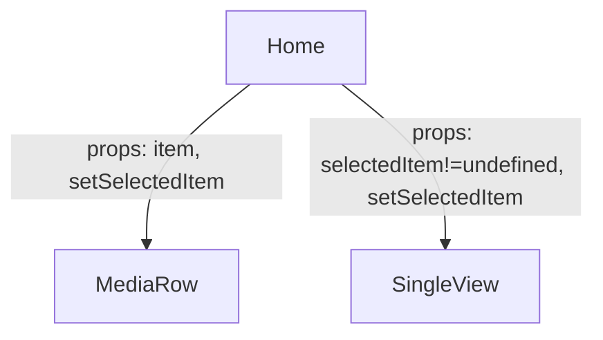

# React State Management

Component state in React refers to an object that holds information that may change over the lifetime of a component. It's essential for interactive elements of a web application, like forms, counters, dynamic filters, etc. Understanding state is crucial for building dynamic and responsive applications in React.

Characteristics:

- **Local to the Component:** State is specific to the component it is declared in. Each component has its own state, and changes in one component's state do not directly affect the state of another component.
- **Mutable:** Unlike props, which are read-only and passed from parent to child components, state is mutable within its own component. It can be updated using the `setState` method in class components or the `useState` hook in functional components.
- **Asynchronous Updates:** When you update the state of a component, React may perform the update asynchronously for performance reasons. This means that if you read the state immediately after setting it, you might not get the updated value. To handle this, React provides ways to work with state updates in a predictable manner.

In class components, the state is often initialized in the constructor (even though we are not using classes in this course, it's good to know basics how they work):

```javascript
class MyComponent extends React.Component {
  constructor(props) {
    super(props);
    this.state = {
      count: 0
    };
  }
  // this.state is used to access the state object.
  // this.setState is used to update the state.
  // It schedules an update to the component’s state object and tells React that this 
  // component and its children need to be re-rendered with the updated state.
  render() {
    return (
      <div>
        <p>You clicked {this.state.count} times</p>
        <button onClick={() => this.setState({ count: this.state.count + 1 })}>
          Click me
        </button>
      </div>
    );
  }
}
```

**Functional components** can also have state using the useState hook:

```javascript
import {useState} from 'react';

const MyComponent = () => {
  const [count, setCount] = useState(0);

  return (
    <div>
      <p>You clicked {count} times</p>
      <button onClick={() => setCount(count + 1)}>
        Click me
      </button>
    </div>
  );
}
```

- `useState` is a Hook that lets you add state to functional components.
- In this example, `useState(0)` returns a pair: the current state value (`count`) and a function that lets you update it (`setCount`).

State is vital for creating interactive applications in React. It enables components to respond to user input, server responses, and other changes, making the UI dynamic and interactive. React's state management is efficient and optimized for performance, as it re-renders the component and its children when the state changes, leading to a responsive user experience.

## Conditional rendering

[Conditional rendering](https://react.dev/learn/conditional-rendering) in React works the same way conditions work in JavaScript. You can use JavaScript operators like `if` or the conditional operator (`&&`) to create elements representing the current state, and let React update the UI to match them.

```javascript
const Greeting = (props) => {
  const [isLoggedIn, setIsLoggedIn] = useState(false);
  if (isLoggedIn) {
    return <UserGreeting />;
  }
  return <GuestGreeting />;
}
// and the same with a ternary operator
const Greeting = (props) => {
  const [isLoggedIn, setIsLoggedIn] = useState(false);
  return isLoggedIn ? <UserGreeting /> : <GuestGreeting />;
}
```

---

## Exercise: Using state for media item selection

`SingleView` component is rendered to display full media file contents when a media item is selected from the list.



1. Create a git branch `state-management` from the previous exercise and checkout to it.
2. Create a new component `SingleView` for rendering a single media item. It should display the title, description, and media content itself.
    - The `SingleView` component should be rendered when a user chooses a media item in the `MediaRow` component. The `SingleView` component could be displayed e.g. on top of the `MediaRow` component.
3. The choice between the `MediaRow` and `SingleView` components should be controlled by a state variable `selectedItem` in the `Home` component. The `selectedItem` should be initialized to `null` and updated when a user clicks a media item in the `MediaRow` component.
    - Create a new state variable `selectedItem` in the `Home` component using the `useState` hook with a initial value `null` : `const [selectedItem, setSelectedItem] = useState(null);`
4. Use `SingleView` component in the `Home` component and pass the `selectedItem` state variable and the `setSelectedItem` function as props to the `SingleView` component.

    ```javascript
    // SingleView.jsx

    const SingleView = (props) => {
      const {item, setSelectedItem} = props;
      return ( 
        // TODO: Add JSX for displaying a mediafile here
        // - use e.g. a <dialog> element for creating a modal
        // - use item prop to render the media item details
        // - use img tag for displaying images
        // - use video tag for displaying videos
      );
    };
    export default SingleView;

    // Home.jsx
    import SingleView from './SingleView';
    ...
    <SingleView item={selectedItem} setSelectedItem={setSelectedItem} />
    ...
    ```

5. Pass the `selectedItem` state variable and the `setSelectedItem` function as props to the `MediaRow` component too (similarly as with the `SingleView` component) Note that the item value should be required when passed as a prop.
6. Add a button for each file in the `MediaRow` component that calls the `setSelectedItem` function with the corresponding media item as a parameter.
    - Use the `setSelectedItem` function to update the `selectedItem` state variable in the `MediaRow` component.
    - Use the `selectedItem` state variable to [conditionally render](https://react.dev/learn/conditional-rendering) the `SingleView` component in the `Home` component.
7. To open/close the `<dialog>` component, use `open` attribute with a boolean value. The dialog is opened when the attribute is present and closed when it is not present. Use the `selectedItem` state variable to control the `open` attribute of the `<dialog>` element in the `SingleView` component.
    - Optionally you can use `useRef` [hook](../Week5/01-hooks#useref) to access the dialog element in the `SingleView` component and use `openModal` and `closeModal` functions to open and close the dialog.
8. Add a button to the `SingleView` component that hides the `SingleView` component (calls the `setSelectedItem` function with `null` as a parameter).
9. Use the item's `media_type` property to determine whether to render an image or a video in the `SingleView` component (use condiotinal rendering).
10. Add your own styling to the `index.css` file to make the `SingleView` component look better. (or use [Teacher's example](./sample-index.css))
11. Commit your changes and push the branch to GitHub `git push origin state-management`.
