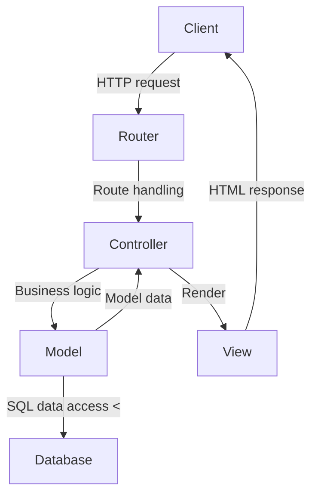
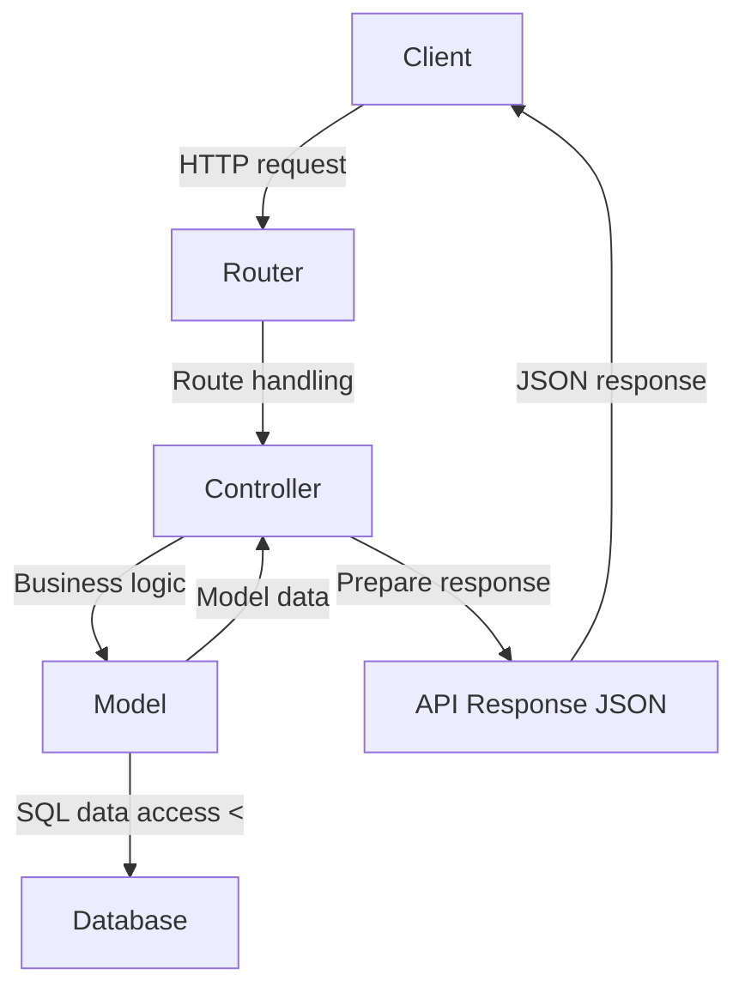

# Routing and middlewares in Express

## Model-View-Controller (MVC)

MVC is a [design pattern](https://en.wikipedia.org/wiki/Software_design_pattern) that divides the application into three
interconnected components:

- **Model**: Represents the application's data and the business rules that govern access to and updates of this data. In
  many cases, the model component is responsible for retrieving data, processing it, and then storing it. It is
  independent of the user interface (UI).
- **View**: Represents the UI of the application. It displays the data that the model contains to the user and sends
  user commands (e.g., button clicks) to the controller. The view is passive, meaning it waits for the model or
  controller to give it data to display.
- **Controller**: Acts as an intermediary between the Model and the View. It listens to events triggered by the View and
  executes the appropriate response, often resulting in a change in the Model's state. Similarly, when the Model
  changes (e.g., data is updated), the Controller is responsible for refreshing the View.

Benefits of MVC:

- Separation of Concerns: By separating the application into these components, MVC aids in the organization of code,
  making it more modular and scalable. Each component has a distinct responsibility.
- Maintainability: With clear separations, developers can work on one aspect of an application (like the UI) without
  having to touch the data logic code. This separation allows teams to work on different parts of an application
  simultaneously.
- Flexibility: The View and the Model can evolve separately. Multiple Views can be created from one Model, which is
  especially useful when you have web, mobile, and other UIs for the same data.
- Reusability: Business logic in the Model can often be reused across different parts of an application or even
  different projects.

Many popular web development frameworks like Django (Python), Ruby on Rails (Ruby), ASP.NET MVC (C#), and **Express**
with Pug or EJS implement the MVC pattern or variations of it. The MVC pattern has been adapted in slightly different
ways by various frameworks, but the core principle remains:

1. When a user sends a n HTTP request, the request first reaches the Controller.
2. The Controller processes the request, interacts with the Model (which might involve querying a database), and then
   decides which View should be used to display the resulting data.
3. The View takes the data, renders it, and sends the resulting webpage back to the user (server-side rendering, SSR).



When adapted to REST API the view is typically represented by the format of the API response (usually JSON), rather than
a traditional user interface which is this case rendered on the client-side (CSR).



## Project structure

Type-based folder structure (typical for Express applications):

```dir
src 
  ├── api/
app.js  ├── controllers/
        │   ├── auth-conroller.js
        │   └── user-controller.js
        │   └── cat-controller.js
        ├── models/
        │   ├── user-model.js
        │   └── cat-model.js
        ├── routes/
        │   ├── auth-router.js
        │   └── user-router.js
        │   └── cat-router.js
        └── index.js
```

Feature-based folder structure:

```dir
src/
├── car/
│   ├── controller.js
│   ├── model.js
│   └── routes.js
├── user/
│   ├── controller.js
│   ├── model.js
│   └── routes.js
└── index.js
```

Both of the folder structures has its benefits. The type-based structure is simple and straightforward, making it easy
to navigate for small projects. The feature-based structure, on the other hand, scales better for larger applications by
grouping all related files by feature, making the codebase more modular and maintainable.

## Routing in Express

[express.Router](https://expressjs.com/en/guide/routing.html#express-router) is a middleware and more advanced routing
system that allows you to modularize your routes into separate files.

### Example

_src/app.js:_

```js
...
import api from './api/index.js';

...
app.use(express.json());
app.use(express.urlencoded({extended: true}));
...
app.use('/api/v1', api);

...
```

_src/api/index.js:_

```js
import express from 'express';
import catRouter from './routes/cat-router.js';

const router = express.Router();

// bind base url for all cat routes to catRouter
router.use('/cats', catRouter);

export default router;
```

_src/api/routes/cat-router.js:_

```js
import express from 'express';
import {
  getCat,
  getCatById,
  postCat,
  putCat,
  deleteCat,
} from '../controllers/cat-controller.js';

const catRouter = express.Router();

catRouter.route('/').get(getCat).post(postCat);

catRouter.route('/:id').get(getCatById).put(putCat).delete(deleteCat);

export default catRouter;
```

_src/api/controllers/cat-controller.js:_

```js
import {addCat, findCatById, listAllCats} from "../models/cat-model.js";

const getCat = (req, res) => {
  res.json(listAllCats());
};

const getCatById = (req, res) => {
  const cat = findCatById(req.params.id);
  if (cat) {
    res.json(cat);
  } else {
    res.sendStatus(404);
  }
};

const postCat = (req, res) => {
  const result = addCat(req.body);
  if (result.cat_id) {
    res.status(201);
    res.json({message: 'New cat added.', result});
  } else {
    res.sendStatus(400);
  }
};

const putCat = (req, res) => {
  // not implemented in this example, this is future homework
  res.sendStatus(200);
};

const deleteCat = (req, res) => {
  // not implemented in this example, this is future homework
  res.sendStatus(200);
};

export {getCat, getCatById, postCat, putCat, deleteCat};
```

_src/api/models/cat-model.js:_

```js
// mock data
const catItems = [
  {
    cat_id: 9592,
    cat_name: 'Frank',
    weight: 11,
    owner: 3609,
    filename: 'f3dbafakjsdfhg4',
    birthdate: '2021-10-12',
  },
  {
    cat_id: 9590,
    cat_name: 'Mittens',
    weight: 8,
    owner: 3602,
    filename: 'f3dasdfkjsdfhgasdf',
    birthdate: '2021-10-12',
  },
];

const listAllCats = () => {
  return catItems;
};

const findCatById = (id) => {
  return catItems.find((item) => item.cat_id == id);
};

const addCat = (cat) => {
  const {cat_name, weight, owner, filename, birthdate} = cat;
  const newId = catItems[0].cat_id + 1;
  catItems.unshift({cat_id: newId, cat_name, weight, owner, filename, birthdate});
  return {cat_id: newId};
};

export {listAllCats, findCatById, addCat};

```

---

## Assignment

1. Create a new branch `Assignment2`
2. Create a new folder `src` in your project folder and move your `app.js` file there.
3. To make the express app easier to test, create `src/index.js` file and import `app.js` from the `src` folder:
    ```javascript
    import app from './app.js';
   
    const hostname = '127.0.0.1';
    const port = 3000;
   
    app.listen(port, hostname, () => {
       console.log(`Server running at http://${hostname}:${port}/`);
    });
    
    ```
4. Remove the above code from the `app.js` file and add the following code to the end of the `app.js` file:
   ```javascript
   export default app;
   ```
5. Update scripts in `package.json` to point `src/index.js`.
6. Create a new folder `api` in your `src` folder
7. Create a new folder `routes` in your `api` folder
8. Create a new folder `controllers` in your `api` folder
9. Create a new folder `models` in your `api` folder
10. Based on the examples above create an Express project with the following routes:
     - `GET /api/v1/cat` - returns all cats
     - `GET /api/v1/cat/:id` - returns one cat by id
     - `POST /api/v1/cat` - adds a new cat
     - `PUT /api/v1/cat/:id` - return hard coded json response: `{message: 'Cat item updated.'}`
     - `DELETE /api/v1/cat/:id` - return hard coded json response: `{message: 'Cat item deleted.'}`
11. Test the endpoints in [Postman](https://www.postman.com/downloads/). Get cats, add a new cat, then get cats again to
    see if the new cat is added.
12. Use the above examples to create routes for users. Create similar dummy data:
     ```javascript
     const userItems = [
       {
          user_id: 3609,
          name: 'John Doe',
          username: 'johndoe',
          email: 'john@metropolia.fi',
          role: 'user',
          password: 'password',
       },
       etc...
     ];
    
     ```
13. Add the following endpoints:
14. `GET /api/v1/user` - returns all users
15. `GET /api/v1/user/:id` - returns one user by id
16. `POST /api/v1/user` - adds a new user
17. `PUT /api/v1/user/:id` - return hard coded json response: `{message: 'User item updated.'}`
18. `DELETE /api/v1/user/:id` - return hard coded json response: `{message: 'User item deleted.'}`
19. Commit and push your branch changes to the remote repository.
20. Merge the `Assignment2` branch to the `main` branch and push the changes to the remote repository.
